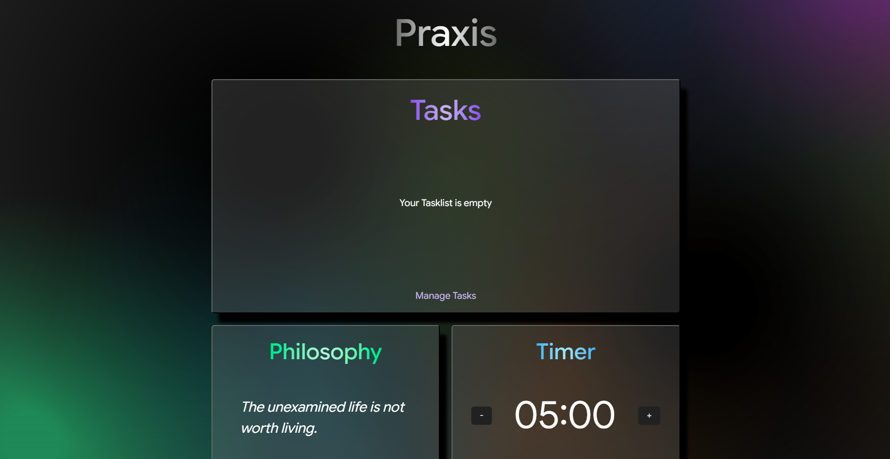

# PRAXIS — Daily Practices & Notes App

> **Disclaimer:** This is a test version. Features and design are subject to significant changes in future updates.

Praxis is a lightweight, client-side web application designed to help users organize and track daily exercises, personal notes, and philosophical reflections.
All data is stored in the browser, so the app works entirely offline and does not require a server. Praxis allows users to structure their day, manage tasks, and maintain focus on personal development habits.

[Live Demo](https://praxis-app-project.vercel.app/)



## Features

* **Daily Timer**: Track focused practice sessions with a countdown timer


* **To-Do List / Notes**: Create, edit, and organize daily tasks and notes


* **Philosophy Section**: A new philosophy daily for reflection and personal growth


* **Client-Side Data**: All user data is stored in the browser `localStorage`


* **Lightweight & Fast**: Minimalistic design with fast load times.

## Installation

### Clone the repository:

``` bash 
  git clone https://github.com/sukmanivskiy/praxis-app-project.git
  cd praxis-app-project
```


### Install dependencies:

``` bash
  npm install --force
```
The --force flag resolves potential peer dependency conflicts.

## Usage

### Start the development server with hot reload:

```bash
  npm run dev
```


### Build the production version:

```bash
  npm run build
```


### Preview the production build locally:

```bash
  npm run preview
```


Open your browser at the provided localhost URL to view the app.


## Project Structure
```
src/
├─ assets/       # Images, icons, fonts
├─ data/         # Static data or JSON templates
├─ modules/      # Reusable JS modules for app logic
├─ notes/        # Note-taking components
├─ philosophy/   # Philosophical reflection components
├─ styles/       # Sass / CSS styles
├─ todo/         # To-Do list components
├─ Timer.js      # Countdown timer logic
├─ index.html    # Main HTML entry point
└─ main.js       # App initialization and module imports
.gitignore
package.json
package-lock.json
vite.config.js
```

## Technologies

* _Vite: Fast development server and build tool_


* _Vanilla JavaScript + Modules: Clean, modular architecture_


* _Sass / CSS: Maintainable and scalable styles_


* _Client-Side Rendering: All logic and data handled in the browser_

## Deployment

Praxis is a client-side application and can be hosted on any static hosting service:

* GitHub Pages

* Netlify

* Vercel

* Cloudflare Pages

Since all user data is stored in the browser, no server-side processing is required. Simply upload the contents of the dist/ folder after building the project:

``` bash
  npm run build
```